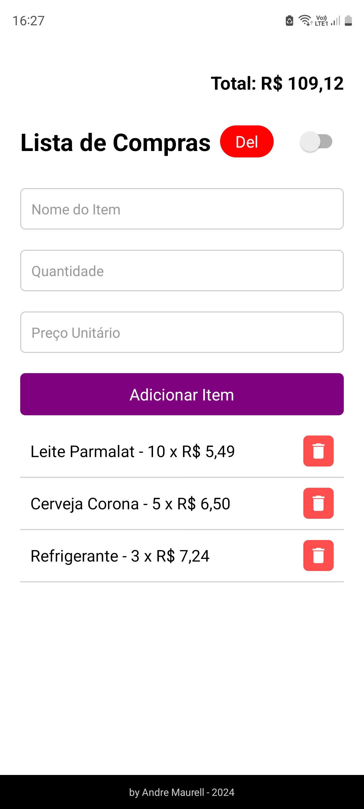

# Projeto Lista de Compras

Este projeto é um aplicativo móvel para gerenciamento de listas de compras, desenvolvido com **Expo**. Ele permite que os usuários adicionem, visualizem e gerenciem suas compras de forma fácil e eficiente diretamente em seus dispositivos móveis.

## Desenvolvimento

Este projeto foi desenvolvido utilizando o **Windsurf**, uma IDE inovadora que permite a colaboração em tempo real entre desenvolvedores e assistentes de IA. O desenvolvimento conjunto com a IA possibilitou uma implementação mais rápida e eficiente, aproveitando as melhores práticas de programação.

## Funcionalidades

- Adicionar itens à lista de compras
- Visualizar itens existentes
- Remover itens da lista

## Como Usar

1. Clone este repositório.
2. Instale as dependências necessárias.
3. Execute a aplicação no seu dispositivo móvel usando o Expo.

## Contribuições

Sinta-se à vontade para contribuir com melhorias ou novas funcionalidades. Para isso, basta abrir uma issue ou enviar um pull request.

## Licença

Este projeto está licenciado sob a MIT License.
